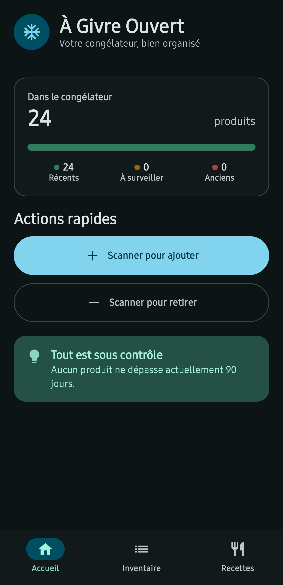
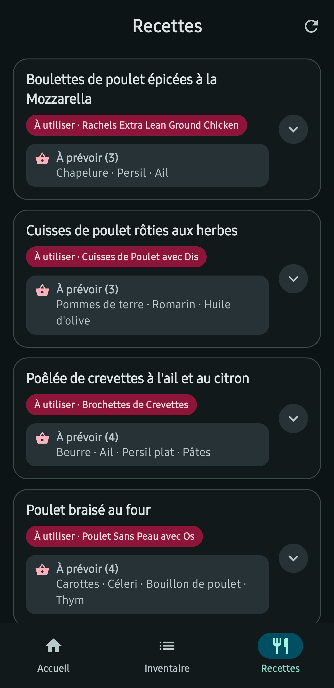

# ❄️ À Givre Ouvert

**À Givre Ouvert** est une application Android accompagnée d’un backend Python local pour inventorier le contenu d’un congélateur, appliquer une rotation FIFO et générer des idées de recettes anti-gaspillage avec Google Gemini.

## Aperçu

L’interface en mode sombre présente l’état du congélateur d’un coup d’œil et les ingrédients manquants directement dans l’aperçu des recettes.

| Accueil et suivi de fraîcheur | Suggestions de recettes |
|:---:|:---:|
|  |  |

## Fonctionnalités

### Scanner de codes-barres

- Lecture locale des codes-barres avec CameraX et Google ML Kit.
- Recherche du produit auprès du backend, du dictionnaire local puis d’Open Food Facts.
- Saisie manuelle lorsqu’un produit est inconnu.
- Mémorisation du nom personnalisé pour les scans suivants.
- Ajout d’un lot ou retrait automatique du lot le plus ancien.

La lecture visuelle du code-barres est locale, mais l’identification et la modification de l’inventaire nécessitent que le backend soit accessible.

### Inventaire FIFO

- Un produit ajouté correspond à un lot individuel.
- Tri du plus ancien au plus récent.
- Indicateurs d’âge :
  - récent : 30 jours ou moins;
  - à surveiller : de 31 à 90 jours;
  - ancien : plus de 90 jours.
- Retrait explicite depuis la liste avec confirmation.
- Copie locale en lecture seule du dernier inventaire synchronisé lorsque le serveur est inaccessible.

### Recettes anti-gaspillage

- Sélection des 15 lots les plus anciens.
- Échantillon aléatoire de 10 lots lorsqu’il y en a plus de 10.
- Génération de 10 suggestions avec `gemini-flash-lite-latest`.
- Affichage de l’ingrédient ciblé et des ingrédients frais manquants directement dans l’aperçu.
- Détails repliables pour les ingrédients et la préparation.
- Gestion distincte du chargement, d’un inventaire vide et des erreurs réseau.

### Interface Android

- Jetpack Compose et Material 3.
- Thème personnalisé bleu glacier, turquoise et corail, avec modes clair et sombre.
- Navigation inférieure entre Accueil, Inventaire et Recettes.
- Accueil avec résumé de fraîcheur et actions de scan.
- Scanner avec cadre de visée et résultat présenté dans une feuille ancrée en bas.

## Stack technique

### Android

- Kotlin et Jetpack Compose
- Material 3
- Navigation Compose
- ViewModel et StateFlow
- Retrofit, OkHttp et Gson
- CameraX et ML Kit Barcode Scanning

### Backend

- Python et FastAPI
- SQLite et SQLModel
- HTTPX pour Open Food Facts
- SDK `google-genai` pour Gemini
- Variables d’environnement chargées avec `python-dotenv`

## Installation

### 1. Backend

Depuis la racine du dépôt :

```powershell
cd backend
python -m venv .venv
.\.venv\Scripts\Activate.ps1
pip install -r requirements.txt
```

Copier `backend/.env.example` vers `backend/.env`, puis renseigner :

```dotenv
GEMINI_API_KEY=votre_cle
```

Lancer ensuite le serveur depuis le dossier `backend` :

```powershell
python -m uvicorn app.main:app --host 0.0.0.0 --port 8096
```

Le fichier `inventory.db` est créé dans le dossier de travail du backend.

### 2. Application Android

Ouvrir le dossier `android` dans Android Studio et ajouter l’adresse du serveur à `android/local.properties` :

```properties
BACKEND_IP=192.168.1.30
```

Le téléphone et le serveur doivent se trouver sur un réseau permettant une connexion vers le port `8096`.

### 3. Compilation

Compiler et installer l’application depuis Android Studio. La compilation de développement peut aussi être lancée avec :

```powershell
cd android
.\gradlew.bat :app:assembleDebug
```

## État du projet

- La compilation `debug` est validée.
- Aucun test automatisé n’est actuellement présent dans le dépôt.
- Une validation manuelle sur téléphone demeure recommandée pour la caméra, les permissions et les différentes tailles d’écran.

Pour les détails techniques, consulter [architecture.md](architecture.md). L’historique se trouve dans [changelog.md](changelog.md).

*Conçu par Sébastien Bédard*
